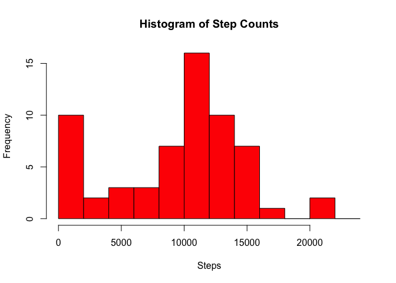
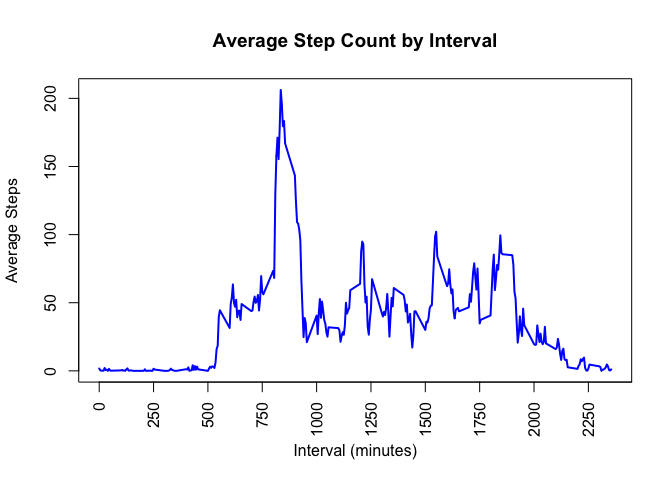

# Reproducible Research: Peer Assessment 1


### Loading and preprocessing the data
We read in the data file and create a convenient data frame to histogram the total number of steps taken each day. We do this by grouping and summarizing the data with dplyr.


```r
## Debug statement toggle
print_yes = FALSE

## Read in the data file
activity <- read.csv("activity.csv")
## Set data type to date
activity$date <- as.Date(activity$date)

## Group by date, summarize
library(dplyr)
by_date <- group_by(activity, date)
total_steps <- summarise(by_date, sum(steps, na.rm = TRUE))

## give easier name
names(total_steps) <- c("date", "steps")
```

### What is the mean total number of steps taken per day?

Below we make a histogram of the total number of steps taken each day. Missing values are ignored (na.rm = TRUE, but no clever replacement of missing values yet.)


```r
## Histogram of step count
with(total_steps, plot(date, steps, type = "h", 
                       main = "Step Count per Day", 
                       xlab = "Date", ylab = "Steps", 
                       col = "blue", lwd = 4))
```

 

We can also calculate the average and median number of steps taken each day.

```r
tot_step_avg <- mean(total_steps$steps, na.rm = TRUE)
tot_step_med <- median(total_steps$steps, na.rm = TRUE)
```
From this calculation we see that the average number of steps per day is 9354 and the median is 10395. 

### What is the average daily activity pattern?
In order to investigate the daily activity patterns we regroup the data by interval, and summarize by the mean step count. 


```r
## group by interval, summarize
by_interval <- group_by(activity, interval)
mean_interval <- summarise(by_interval, mean(steps, na.rm = TRUE))

## give easier name
names(mean_interval) <- c("interval", "steps_avg")
```

Now, we can plot the the number of steps per interval averaged over all days.  Remember that missing values are still being ignored.

```r
with(mean_interval, plot(interval, steps_avg, type = "l", 
                       main = "Average Step Count by Interval", 
                       xlab = "Interval (minutes)", ylab = "Average Steps", 
                       col = "blue", lwd = 2, xaxt = "n"))
axis(side=1, at=seq(0,2500, 250), labels=seq(0,2500,250), las = 2)
```

 

From the graph we can see that the inerval with the highest number of steps lies somewhere between 750 and 1000 minutes. To obtain a more precise picture we calculate the maximum number of steps and find the interval when it happens exactly.


```r
## Find interval when step count is largest
max_steps <- max(mean_interval$steps_avg, na.rm = TRUE)
max_interval <- mean_interval$interval[which(mean_interval$steps_avg == max_steps)]
```
The interval with the largest number of steps is interval 835 with a step count of 206. 

### Inputing missing values
Until now we ignored the missing values.  In order to reduce the bias this naive approach can introduce to the analysis, we replace missing step counts with the average step count across all days for the given interval.  


```r
## Keep data with missing values
activity_missing <- as.data.frame(activity)
## Calculate number of NAs
na_count <- 0
for(i in 1:length(activity$steps)){
  if(is.na(activity$steps[i])){
    #increment na count
    na_count <- na_count + 1
    if (print_yes) print(na_count)
    # get the interval that is na
    int_na <- activity$interval[i]
    if (print_yes) print(paste("Interval:",int_na))
    if (print_yes) print(paste("Old value:", activity$steps[i]))
    # overwrite this interval with 
    # the average for the interval across all days
    activity$steps[i] <- 
      as.integer(mean_interval[mean_interval$interval==int_na,"steps_avg"])
    if (print_yes) print(paste("New value:", activity$steps[i]))
  }
}
## Rename new dataset to avoid confusion
activity_no_miss <- as.data.frame(activity)
```

A total of 2304 missing values have been replaced with the interval average. We reproduce the original histogram with this data set.


```r
## Group, summarize, rename
by_date_no_miss <- group_by(activity_no_miss, date)
total_steps_no_miss <- summarise(by_date_no_miss, 
                                 sum(steps, na.rm = TRUE))

names(total_steps_no_miss) <- c("date", "steps")

## Remake histogram
with(total_steps_no_miss, plot(date, steps, type = "h", 
                          main = "Step Count per Day", 
                          xlab = "Date", ylab = "Steps", 
                          col = "green", lwd = 4))
```

 


### Are there differences in activity patterns between weekdays and weekends?
We add a column to the data frame with the day of the week, then subset into two groups 'weekday' and 'weekend.' 


```r
# add a column to the data frame (the one with no missing values)
day <- c("day")
activity_no_miss[, day] <- "na"

# fill new column with weekday or weekend
for(i in 1:length(activity_no_miss$date)){
  if(weekdays(activity_no_miss$date[i]) == "Saturday" |
       weekdays(activity_no_miss$date[i]) == "Sunday"){
    activity_no_miss$day[i] = "weekend"
  } else{
    activity_no_miss$day[i] = "weekday"
  }
}

by_day <- activity_no_miss %>%
  group_by(interval, day) %>%
  summarise(mean(steps))

names(by_day) <- c("interval", "day", "steps_avg")
```

We then plot the data to compare the activity behavior on weekdays and weekends.

```r
library(lattice)
xyplot(steps_avg ~ interval | day, by_day, 
       type = "l", layout=c(1,2))
```

 

The plot shows that overall patterns are similar between weekdays and weekends.  People start moving earlier on weekdays, and take more steps through the day, especially around the peak interval. This interval corresponds to the early afternoon; a possible interpretation is increased activity at lunch time while at work. Weekends on the other hand have a relatively flat distribution of steps through the day as well as fewer steps overall. Activity slows and ends a little later on the weekend too, suggesting a later bedtime. (Sunday and Friday nights can skew this).

